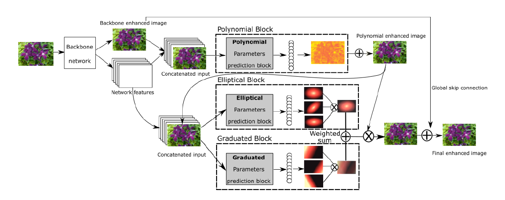

# DeepLPF: Deep Local Parametric Filters for Image Enhancement (Paper accepted to CVPR 2020)

[Sean Moran](http://www.seanjmoran.com), Pierre Marza, Steven McDonagh, [Sarah Parisot](https://parisots.github.io/), [Greg Slabaugh](http://gregslabaugh.net/)

Huawei Noah's Ark Lab

### [[Paper]](https://arxiv.org/abs/2003.13985) 

<p align="center">

</p>
Repository for the paper DeepLPF: Deep Local Parametric Filters for Image Enhancement. Here you will find the code, pre-trained models, information of the datasets, and information on the training procedure for our models. Please raise a Github issue if you need assistance of have any questions on the research. 
<p></p>

### Bibtex

```
@misc{moran2020deeplpf,
    title={DeepLPF: Deep Local Parametric Filters for Image Enhancement},
    author={Sean Moran and Pierre Marza and Steven McDonagh and Sarah Parisot and Gregory Slabaugh},
    year={2020},
    eprint={2003.13985},
    archivePrefix={arXiv},
    primaryClass={cs.CV}
}
```

### Datasets

* __Adobe-DPE__ (5000 images, RGB, RGB pairs): this dataset can be downloaded [here](https://data.csail.mit.edu/graphics/fivek/). After downloading this dataset you will need to use Lightroom to pre-process the images according to the procedure outlined in the DeepPhotoEnhancer (DPE) [paper](https://github.com/nothinglo/Deep-Photo-Enhancer). Please see the issue [here](https://github.com/nothinglo/Deep-Photo-Enhancer/issues/38#issuecomment-449786636) for instructions. Artist C retouching is used as the groundtruth/target. Feel free to raise a Gitlab issue if you need assistance with this (or indeed the Adobe-UPE dataset below). You can also find the training, validation and testing dataset splits for Adobe-DPE in the following [file](https://www.cmlab.csie.ntu.edu.tw/project/Deep-Photo-Enhancer/%5BExperimental_Code_Data%5D_Deep-Photo-Enhancer.zip). 

* __Adobe-UPE__ (5000 images, RGB, RGB pairs): this dataset can be downloaded [here](https://data.csail.mit.edu/graphics/fivek/). As above, you will need to use Lightroom to pre-process the images according to the procedure outlined in the Underexposed Photo Enhancement Using Deep Illumination Estimation (DeepUPE) [paper](https://github.com/wangruixing/DeepUPE) and detailed in the issue [here](https://github.com/wangruixing/DeepUPE/issues/26). Artist C retouching is used as the groundtruth/target. You can find the test images for the Adobe-UPE dataset at this [link](https://drive.google.com/file/d/1HZnNgptNxjKJAhekz2K5yh0mW0yKIws2/view?usp=sharing).
