# DeepLPF: Deep Local Parametric Filters for Image Enhancement (CVPR 2020)

[Sean Moran](https://sjmoran.github.io/), [Pierre Marza](https://pierremarza.github.io/), [Steven McDonagh](https://smcdonagh.github.io/), [Sarah Parisot](https://parisots.github.io/), [Greg Slabaugh](https://eecs.qmul.ac.uk/~gslabaugh/)

**Huawei Noah's Ark Lab**

Official PyTorch implementation of the CVPR 2020 paper **DeepLPF: Deep Local Parametric Filters for Image Enhancement**. DeepLPF enhances an image by regressing the parameters of a small set of spatially localised image filters — cubic, graduated and elliptical — and applying them, rather than predicting output pixels directly. On the Adobe-DPE benchmark the pre-trained model in this repository reaches **23.90 dB PSNR / 0.911 SSIM**.

This repository contains the code, the pre-trained models, and instructions for preparing the datasets. If you use DeepLPF in your research, please cite [the paper](#citation) (BibTeX below). Please raise a GitHub issue if you need assistance or have any questions on the research.

**_Training your own DeepLPF:_** if you have difficulties, please contact the lead author for assistance. We are happy to help with any queries regarding the model.

**_BATCH SIZE: Note this code is designed for a batch size of 1. It needs to be re-engineered to support higher batch sizes. Using higher batch sizes is not supported currently. To replicate our reported results please use a batch size of 1 only. If you do have a patch for DeepLPF to support higher batch sizes please raise a pull request on this repo and we will integrate._**

<p align="center">
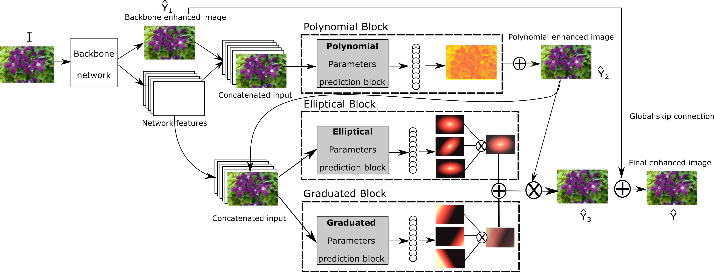
</p>

### [[Paper]](https://arxiv.org/abs/2003.13985) [[Poster]](https://github.com/sjmoran/sjmoran.github.io/blob/main/pdfs/DeepLPF_CVPR20_poster.pdf) [[Video]](https://www.youtube.com/watch?v=Sxach3FM6FY) [[Supplementary]](https://github.com/sjmoran/sjmoran.github.io/blob/7775d1fc39d14baeb6935f6c750f923e1251f491/pdfs/DeepLPF_supplementary.pdf) 

<p align="center">
<a href="https://www.youtube.com/watch?v=Sxach3FM6FY" span>
   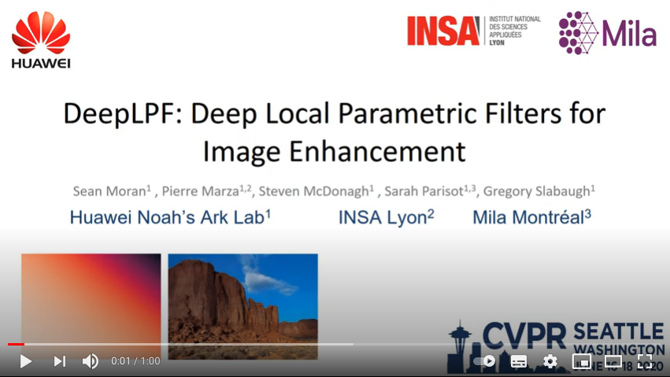
</a>
<a href="https://github.com/sjmoran/sjmoran.github.io/blob/main/pdfs/DeepLPF_CVPR20_poster.pdf" span>
   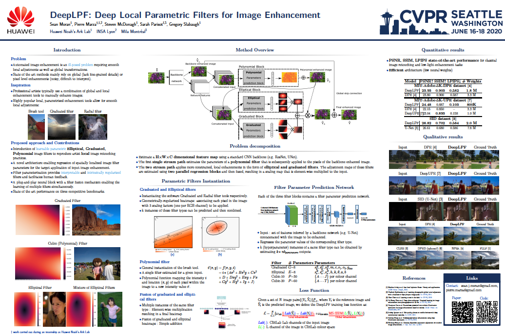
</a>
</p>

<table>
       <tr>
    <th>Input</th>
    <th>Label</th>
    <th>Ours (DeepLPF)</th>
  </tr>
  <tr>
      <td></td>   
     <td>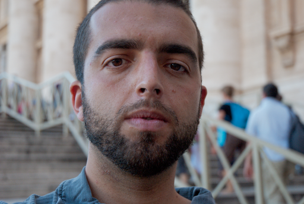</td> 
    <td></td> 
  </tr>
    <tr>
    <th>Input</th>
    <th>Label</th>
    <th>Ours (DeepLPF)</th>
  </tr>
  <tr>
      <td>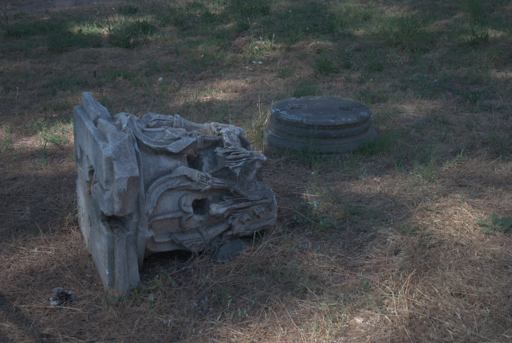</td>   
     <td>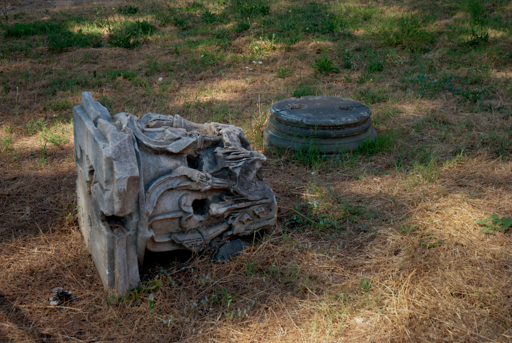</td> 
    <td>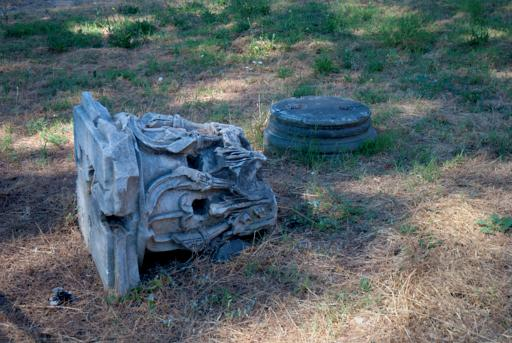</td> 
  </tr>
    <tr>
    <th>Input</th>
    <th>Label</th>
    <th>Ours (DeepLPF)</th>
  </tr>
  <tr>
      <td>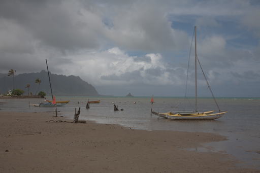</td>     
     <td></td> 
    <td></td> 
  </tr>
    <tr>
    <th>Input</th>
    <th>Label</th>
    <th>Ours (DeepLPF)</th>
  </tr>
  <tr>
      <td></td>     
     <td></td> 
    <td></td> 
  </tr>
    <tr>
    <th>Input</th>
    <th>Label</th>
    <th>Ours (DeepLPF)</th>
  </tr>
  <tr>
      <td>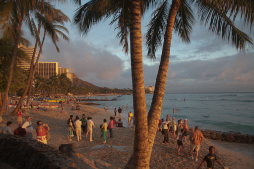</td>     
     <td></td> 
    <td></td> 
  </tr>
  <tr>
    <th>Input</th>
    <th>Label</th>
    <th>Ours (DeepLPF)</th>
  </tr>
  <tr>
      <td></td>     
     <td></td> 
    <td></td> 
  </tr>
  <tr>
    <th>Input</th>
    <th>Label</th>
    <th>Ours (DeepLPF)</th>
  </tr>
  <tr>
    <td>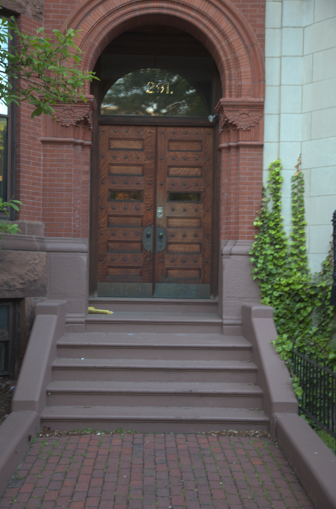</td>     
     <td>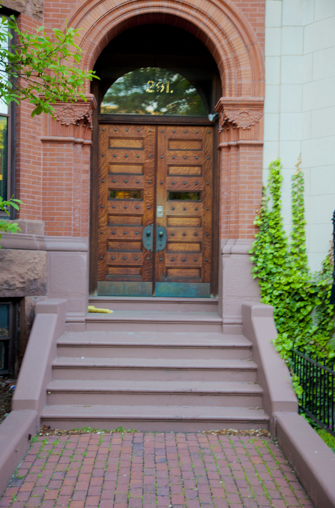</td>     
     <td>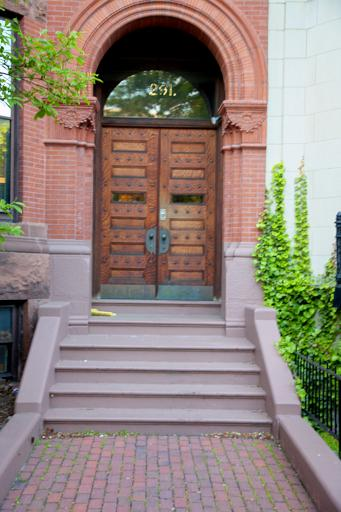</td> 
  </tr>
  <tr>
    <th>Input</th> 
    <th>Label</th>
    <th>Ours (DeepLPF)</th>
  </tr>
  <tr>
    <td></td>   
     <td>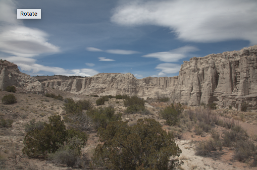</td>     <td>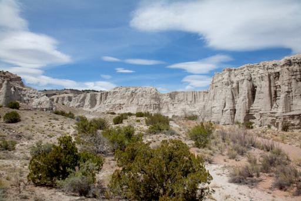</td> 
  </tr>
     <tr>
    <th>Input</th> 
    <th>Label</th>
    <th>Ours (DeepLPF)</th>
  </tr>
  <tr>
    <td></td>   
     <td></td>     
     <td></td> 
  </tr>
        <tr>
    <th>Input</th> 
    <th>Label</th>
    <th>Ours (DeepLPF)</th>
  </tr>
  <tr>
    <td>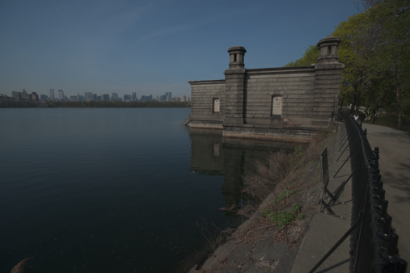</td>   
     <td>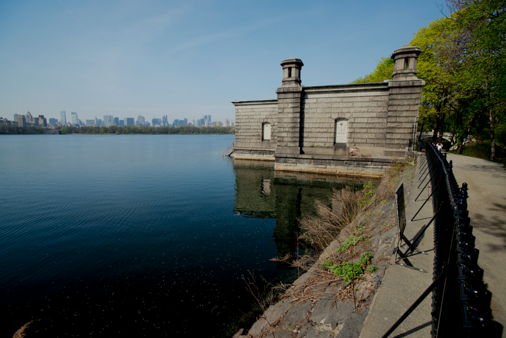</td>     
     <td>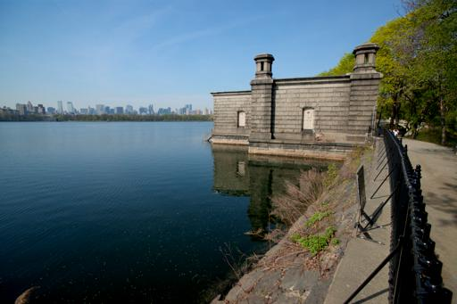</td> 
  </tr>
</table>

### Dependencies

_requirements.txt_ lists the Python packages used by the code; install them with `pip install -r requirements.txt`.

The code selects the best available device automatically and runs on a CUDA GPU, Apple Silicon (MPS), or CPU.

### How to train DeepLPF and use the model for inference

#### Training DeepLPF

Instructions:

To get this code working on your system / problem you will need to edit the data loading functions, as follows:

1. data.py, lines 248, 256, change the folder names of the data input and output directories to point to your folder names

To train, run the command:

```
python3 main.py --training_img_dirpath=../adobe5k/ --train_img_list_path=../adobe5k/images_train.txt --valid_img_list_path=../adobe5k/images_valid.txt --test_img_list_path=../adobe5k/images_test.txt
```

<p align="center">
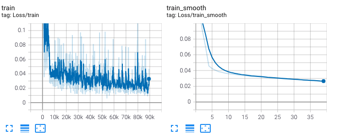
</p>

#### Inference - Using Pre-trained Models for Prediction

The directory _pretrained_models_ contains a set of four DeepLPF pre-trained models on the _Adobe5K_DPE dataset_, each model output from different epochs. The model with the highest validation dataset PSNR (23.90 dB) is at epoch 424:

* deeplpf_validpsnr_23.378_validloss_0.033_testpsnr_23.904_testloss_0.031_epoch_424_model.pt

This model achieves a PSNR of 23.90dB and an SSIM of 0.911 on the Adobe_DPE image dataset. To inference with this model, follow these instructions:

1. Place the images you wish to infer in a directory e.g. ./adobe5k_dpe/deeplpf_example_test_input/. Make sure the directory path has the word "input" somewhere in the path.
2. Place the images you wish to use as groundtruth in a directory e.g. ./adobe5k_dpe/deeplpf_example_test_output/. Make sure the directory path has the word "output" somewhere in the path.
3. Place the names of the images (without extension) in a text file in the directory above the directory containing the images i.e. ./adobe5k_dpe/ e.g. ./adobe5k_dpe/images_inference.txt
4. Run the command and the results will appear in a timestamped directory in the same directory as main.py:

```
python3 main.py --inference_img_list_path=./adobe5k_dpe/images_inference.txt --inference_img_dirpath=./adobe5k_dpe/ --checkpoint_filepath=./pretrained_models/adobe_dpe/deeplpf_validpsnr_23.378_validloss_0.033_testpsnr_23.904_testloss_0.031_epoch_424_model.pt
```

### Pre-trained models

* Adobe-DPE: see pretrained_models/adobe_dpe directory. Model trained on the Adobe5K dataset using the splits and image pre-processing outlined in the DeepPhotoEnhancer paper.
* Adobe-UPE: see pretrained_models/adobe_upe directory. Model trained on the Adobe5K dataset using the splits and image pre-processing outlined in the DeepUPE paper. Thanks to Yucheng Lu (yucheng.l@outlook.com) for this pre-trained model. The model was applied in [this paper](https://arxiv.org/abs/2106.14844).

### Citation

If you use DeepLPF, its pre-trained models, or this code in your research, please cite:

```
@InProceedings{Moran_2020_CVPR,
author = {Moran, Sean and Marza, Pierre and McDonagh, Steven and Parisot, Sarah and Slabaugh, Gregory},
title = {DeepLPF: Deep Local Parametric Filters for Image Enhancement},
booktitle = {Proceedings of the IEEE/CVF Conference on Computer Vision and Pattern Recognition (CVPR)},
month = {June},
year = {2020}
}
```

### Datasets

* __Adobe-DPE__ (5000 images, RGB, RGB pairs): this dataset can be downloaded [here](https://data.csail.mit.edu/graphics/fivek/). After downloading this dataset you will need to use Lightroom to pre-process the images according to the procedure outlined in the DeepPhotoEnhancer (DPE) [paper](https://github.com/nothinglo/Deep-Photo-Enhancer). Please see the issue [here](https://github.com/nothinglo/Deep-Photo-Enhancer/issues/38#issuecomment-449786636) for instructions. Artist C retouching is used as the groundtruth/target. Note, the images must be extracted in sRGB space. Feel free to raise a GitHub issue if you need assistance with this (or indeed the Adobe-UPE dataset below). You can also find the training, validation and testing dataset splits for Adobe-DPE in the following [file](https://www.cmlab.csie.ntu.edu.tw/project/Deep-Photo-Enhancer/%5BExperimental_Code_Data%5D_Deep-Photo-Enhancer.zip). The splits can also be found in the [adobe5k_dpe](./adobe5k_dpe/) directory in this repository (note these are a best guess at what the original splits from the DPE authors might be).

* __Adobe-UPE__ (5000 images, RGB, RGB pairs): this dataset can be downloaded [here](https://data.csail.mit.edu/graphics/fivek/). As above, you will need to use Lightroom to pre-process the images according to the procedure outlined in the Underexposed Photo Enhancement Using Deep Illumination Estimation (DeepUPE) [paper](https://github.com/wangruixing/DeepUPE) and detailed in the issue [here](https://github.com/wangruixing/DeepUPE/issues/26). Artist C retouching is used as the groundtruth/target. You can find the test images for the Adobe-UPE dataset at this [link](https://drive.google.com/file/d/1HZnNgptNxjKJAhekz2K5yh0mW0yKIws2/view?usp=sharing).

### License

BSD-3-Clause License

### Contributions

We appreciate all contributions. If you are planning to contribute back bug-fixes, please do so without any further discussion.

If you plan to contribute new features, utility functions or extensions to the core, please first open an issue and discuss the feature with us. Sending a PR without discussion might end up resulting in a rejected PR, because we might be taking the core in a different direction than you might be aware of.

### Errata for Paper(s) referencing DeepLPF

* **[Deep Symmetric Network for Underexposed Image Enhancement with Recurrent Attentional Learning](https://www.shaopinglu.net/publications_files/ICCV21_Image_Enhancement.pdf)**
* The results in Fig 1. for DeepLPF in this paper are incorrect. An example of inference for one of the images in Fig 1. is supplied [here](./images/004668_TEST_25_354_PSNR_21.848_SSIM_0.858.jpg). For replication, we provide our DeepLPF pre-trained model for their dataset [here](./pretrained_models/adobe_distort_and_recover/deeplpf_validpsnr_23.629675866286313_validloss_0.030986817553639412_testpsnr_23.629675866286313_testloss_0.030986817553639412_epoch_49_model.pt). The quantitative results in Table 1 for DeepLPF should be: **23.63dB, 0.875 SSIM**. 
* **29th September 2021**: The paper authors have graciously noted this issue and have created an errata to their ICCV paper [here](https://www.shaopinglu.net/proj-iccv21/ImageEnhancement.html). We thank the authors and appreciate their time commitment and close collaboration in re-checking the DeepLPF result in their paper.
