# DeepLPF: Deep Local Parametric Filters for Image Enhancement (CVPR 2020)

[](https://github.com/sjmoran/deeplpf-image-enhancement/actions/workflows/ci.yml)
[](https://arxiv.org/abs/2003.13985)

[](https://github.com/sjmoran/deeplpf-image-enhancement/stargazers)

[Sean Moran](https://sjmoran.github.io/), [Pierre Marza](https://pierremarza.github.io/), [Steven McDonagh](https://smcdonagh.github.io/), [Sarah Parisot](https://parisots.github.io/), [Greg Slabaugh](https://eecs.qmul.ac.uk/~gslabaugh/) — **Huawei Noah's Ark Lab**

[[Paper]](https://arxiv.org/abs/2003.13985) [[Poster]](https://github.com/sjmoran/sjmoran.github.io/blob/main/pdfs/DeepLPF_CVPR20_poster.pdf) [[Video]](https://www.youtube.com/watch?v=Sxach3FM6FY) [[Supplementary]](https://github.com/sjmoran/sjmoran.github.io/blob/7775d1fc39d14baeb6935f6c750f923e1251f491/pdfs/DeepLPF_supplementary.pdf)

Official PyTorch implementation of the CVPR 2020 paper **DeepLPF: Deep Local Parametric Filters for Image Enhancement**. Instead of predicting output pixels directly, DeepLPF regresses the parameters of a small set of spatially localised image filters (cubic, graduated and elliptical) and applies them, giving an interpretable retouching model. The bundled pre-trained model scores **23.90 dB PSNR / 0.911 SSIM**. Every number in this repository names the protocol it was measured under; see [Which number, which protocol](#which-number-which-protocol), the axis most FiveK comparisons go wrong on.

<p align="center">
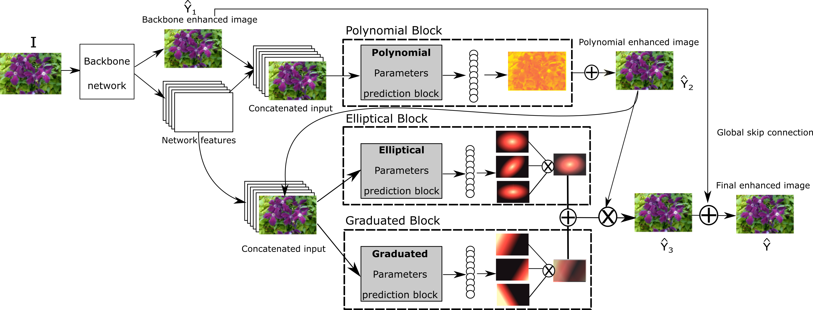
</p>

## Contents

- [Quick start](#quick-start)
- [Results](#results)
- [How it works](#how-it-works)
- [Pre-trained models](#pre-trained-models)
- [Training](#training)
- [Reproducing the Adobe-DPE results](#reproducing-the-adobe-dpe-results)
- [Auditing your own model](#auditing-your-own-model)
- [Which number, which protocol](#which-number-which-protocol)
- [Datasets](#datasets)
- [Original (CVPR 2020) code](#original-cvpr-2020-code)
- [Citation](#citation)
- [License](#license)
- [Contributing](#contributing)
- [Errata](#errata)

## Quick start

```bash
git clone https://github.com/sjmoran/deeplpf-image-enhancement.git
cd deeplpf-image-enhancement
pip install -r requirements.txt

# Enhance the bundled example images with the pre-trained Adobe-DPE model.
# Results (with PSNR/SSIM in the filenames) appear in a timestamped log_* directory.
python3 main.py \
  --inference_img_list_path=./adobe5k_dpe/images_inference.txt \
  --inference_img_dirpath=./adobe5k_dpe/ \
  --checkpoint_filepath=./pretrained_models/adobe_dpe/deeplpf_validpsnr_23.378_validloss_0.033_testpsnr_23.904_testloss_0.031_epoch_424_model.pt
```

The code picks the best available device automatically: a CUDA GPU, Apple Silicon (MPS), or CPU. No configuration is needed.

## Results

| Model | Split | PSNR | SSIM |
|---|---|---|---|
| bundled `adobe_dpe`, epoch 424 | reconstructed | 23.90 dB | 0.911 |
| retrained, `--fixes=none` | recovered DPE | 23.38 dB | 0.897 |
| retrained, `--fixes=blend,ellipse,fusion,ste` | recovered DPE | 23.76 dB | 0.901 |
| published DeepLPF (NamedCurves Tab. 1) | DPE | 23.93 dB | 0.903 |

**Match the split column before comparing any two rows.** The bundled
checkpoint was trained and scored under the reconstructed split, which overlaps
the DPE protocol in 45 of ~500 test images; the retrained rows use the recovered
original DPE lists and are the ones to line up against published DPE numbers.
On the 45 images held out by both, the retrained model and the released
checkpoint are statistically indistinguishable (paired difference -0.29 dB, 95%
CI +/-1.10), which is the like-for-like comparison the two protocols permit.
Training details in [docs/V2_ABLATION.md](./docs/V2_ABLATION.md).

Input → expert-retouched label → DeepLPF output:

<table>
  <tr><th>Input</th><th>Label</th><th>Ours (DeepLPF)</th></tr>
  <tr>
    <td>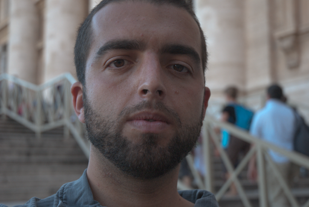</td>
    <td>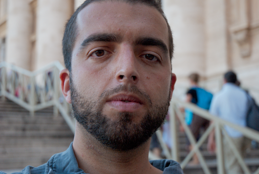</td>
    <td>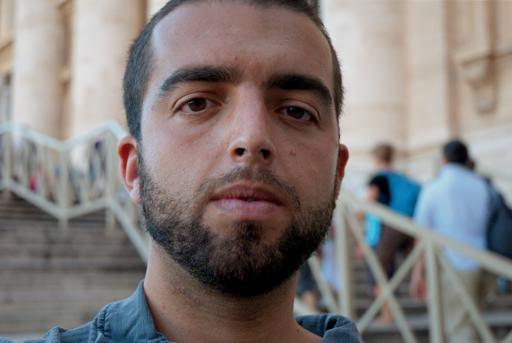</td>
  </tr>
  <tr>
    <td>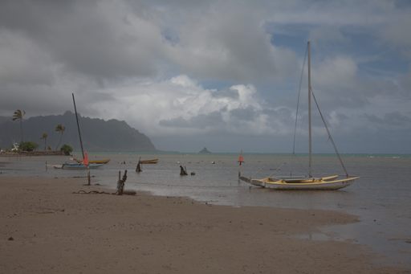</td>
    <td>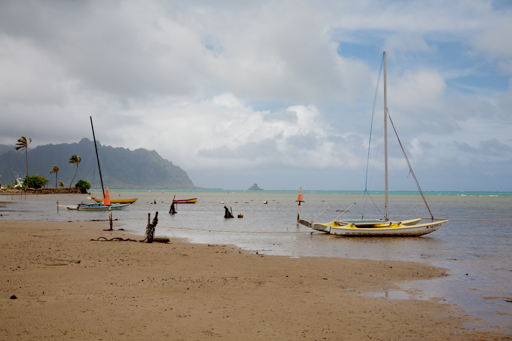</td>
    <td></td>
  </tr>
  <tr>
    <td>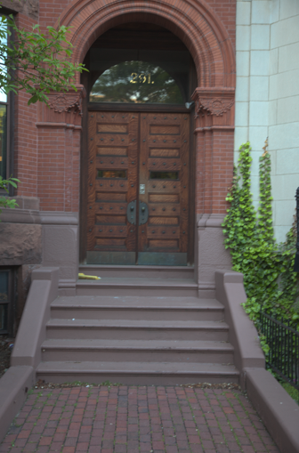</td>
    <td>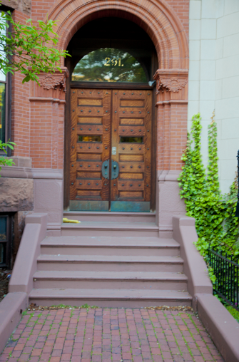</td>
    <td>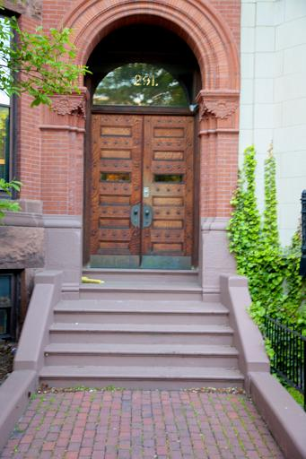</td>
  </tr>
</table>

<details>
<summary>More examples</summary>

<table>
  <tr><th>Input</th><th>Label</th><th>Ours (DeepLPF)</th></tr>
  <tr>
    <td>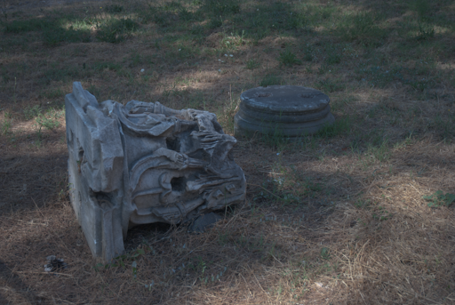</td>
    <td>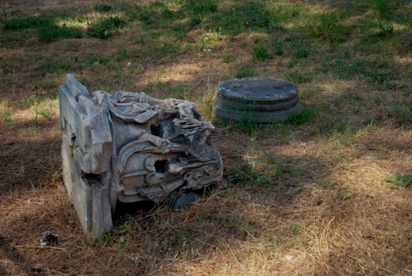</td>
    <td>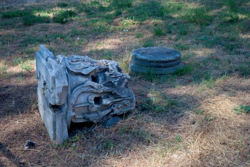</td>
  </tr>
  <tr>
    <td>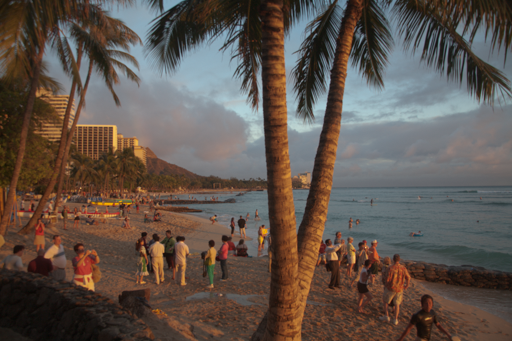</td>
    <td>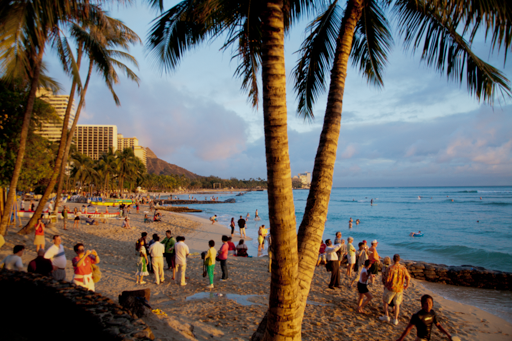</td>
    <td>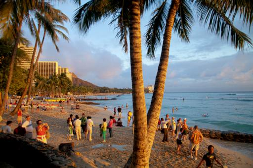</td>
  </tr>
  <tr>
    <td></td>
    <td></td>
    <td></td>
  </tr>
  <tr>
    <td></td>
    <td>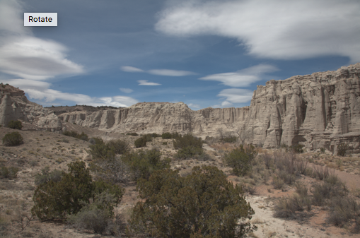</td>
    <td>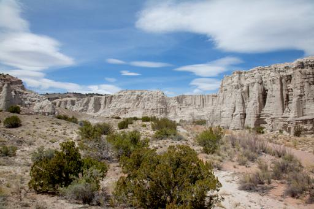</td>
  </tr>
  <tr>
    <td></td>
    <td></td>
    <td></td>
  </tr>
  <tr>
    <td>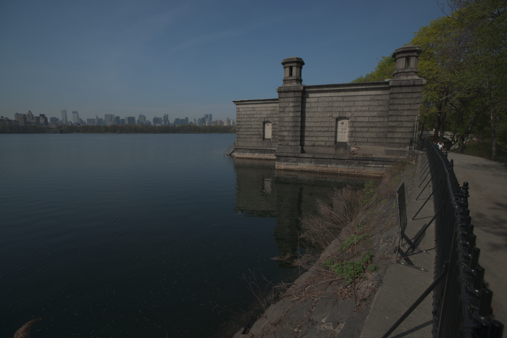</td>
    <td>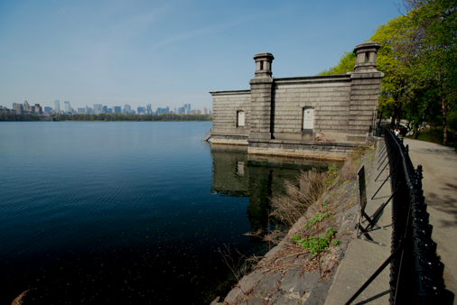</td>
    <td>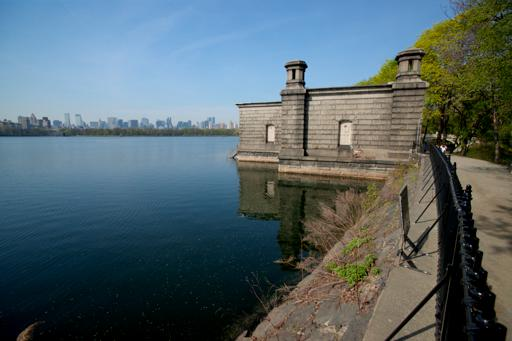</td>
  </tr>
</table>

</details>

## How it works

A U-Net backbone extracts per-pixel features from the input image. Three lightweight heads then regress the parameters of three interpretable filter families, which are applied in sequence to produce the enhanced image:

- **Cubic**: a global cubic polynomial in the pixel intensity and image coordinates (a learned tone/colour curve).
- **Graduated**: graduated neutral-density-style filters that scale the image along learned lines.
- **Elliptical**: radial/vignette-style filters that scale within learned ellipses.

Because the network predicts a small set of human-meaningful filter parameters rather than dense pixel values, its adjustments are interpretable. See the [paper](https://arxiv.org/abs/2003.13985) for the full formulation.

## Pre-trained models

Checkpoints are in `pretrained_models/`:

- **Adobe-DPE** (`pretrained_models/adobe_dpe/`): trained on Adobe5K with the DeepPhotoEnhancer pre-processing. The best-validation checkpoint (epoch 424) reaches 23.90 dB PSNR / 0.911 SSIM, measured on the best-guess split this repository shipped before the original DPE lists were recovered — see [`adobe5k_dpe/SPLIT_PROVENANCE.md`](./adobe5k_dpe/SPLIT_PROVENANCE.md). It is the checkpoint used in the [Quick start](#quick-start).
- **Adobe-UPE** (`pretrained_models/adobe_upe/`): trained on Adobe5K using the splits and pre-processing from the DeepUPE paper. Contributed by Yucheng Lu (yucheng.l@outlook.com) and applied in [this paper](https://arxiv.org/abs/2106.14844).

## Training

Prepare the dataset first (see [Datasets](#datasets)), so you have a directory with `input/` and `output/` sub-folders. Then:

```bash
python3 main.py \
  --training_img_dirpath=./adobe5k_dpe_data/ \
  --train_img_list_path=./adobe5k_dpe/images_train.txt \
  --valid_img_list_path=./adobe5k_dpe/images_valid.txt \
  --test_img_list_path=./adobe5k_dpe/images_test.txt \
  --batch_size=1
```

Training supports a batch size greater than one via `--batch_size` for throughput; use `--batch_size=1` to reproduce the paper's setup. Evaluation and inference run at a batch size of 1 so per-image PSNR/SSIM are reported and saved. Checkpoints are written whenever validation PSNR improves.

<p align="center">
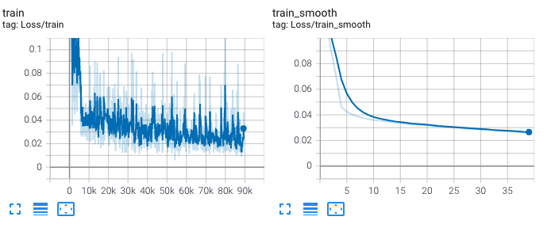
</p>

## Reproducing the Adobe-DPE results

End to end, from a clean clone to a trained model. Every step is checkable, so
you find out at the step that went wrong rather than at the end.

**1. Environment.** Python 3.11 or newer.

```bash
pip install -r requirements.txt
```

**2. Get the raw data.** Download the MIT-Adobe FiveK archive (about 47 GB of
DNGs plus the Lightroom catalogue) from
[the dataset page](https://data.csail.mit.edu/graphics/fivek/).

**3. Render the pairs in Lightroom.** This step needs Lightroom Classic and
cannot be scripted from outside it; the DNGs have to be developed through
Adobe's renderer to match the published data. Open
`fivek_dataset/raw_photos/fivek.lrcat` and export two collections, both as
**PNG / sRGB / 8-bit / long edge 512 px / don't enlarge / original filenames**:

| Collection | Destination | Role |
|---|---|---|
| `InputAsShotZeroed` | `~/fivek/input` | network input |
| `Experts / C` | `~/fivek/output` | target |

The input collection matters. `InputAsShotZeroed` is the one that reproduces
this repo's bundled reference inputs exactly; the `... minus 1.5` renderings
apply a −1.5 EV exposure cut and give inputs roughly 1.6× too dark. Full
walkthrough, including a Lightroom plug-in that does both exports:
[docs/ADOBE_DPE_DATASET.md](./docs/ADOBE_DPE_DATASET.md).

**4. Organise and verify.**

```bash
python3 data_prep/organise_fivek.py ~/fivek/input ~/fivek/output \
    ./adobe5k_dpe_data --long-edge 512 --no-resize
python3 data_prep/verify_dataset.py ./adobe5k_dpe_data
```

First check the export itself against the reference manifest:

```bash
python3 data_prep/verify_export.py ./adobe5k_dpe_data adobe5k_dpe/MANIFEST.json.gz
```

The FiveK photographs are their photographers' copyright and cannot be
redistributed, so this repository ships checksums and per-image statistics
instead — enough to tell you whether your own export matches ours, and what is
wrong when it does not. A correct export reports every image byte-identical. A
wrong one is diagnosed rather than merely rejected, for example:

```
40 differ in pixel values:
  a0001-jmac_DSC1459.png     mean delta R -37.01 G -36.97 B -35.32
-> your images are 32.3 levels darker than the reference: this is the
   signature of a `... minus 1.5` Inputs rendering, which applies a -1.5 EV
   exposure cut. Re-export from `InputAsShotZeroed`.
```

`verify_dataset.py` is then the checkpoint for the whole stage. Expect 5000 pairs
split 2250 train / 2250 valid / 498 test, fully paired, and `mean|Δ|` under 15
against the bundled reference inputs. A large `mean|Δ|` means the wrong `Inputs`
rendering was exported — re-export the inputs and run it again.

**5. Train.**

```bash
python3 main.py \
  --training_img_dirpath=./adobe5k_dpe_data/ \
  --train_img_list_path=./adobe5k_dpe/images_train.txt \
  --valid_img_list_path=./adobe5k_dpe/images_valid.txt \
  --test_img_list_path=./adobe5k_dpe/images_test.txt \
  --batch_size=1
```

Checkpoints are written whenever validation PSNR improves, into a timestamped
`log_*` directory, with the metrics in the filename.

**What to expect.** On the recovered DPE lists, `--fixes=none` reaches 23.38 dB
test PSNR after 500 epochs and the best fix combination reaches 23.76 dB, with
longer schedules still improving; both are tabulated in
[docs/V2_ABLATION.md](./docs/V2_ABLATION.md). Compare against those rows rather
than the released checkpoint's 23.90, which belongs to the reconstructed split.
See [`adobe5k_dpe/SPLIT_PROVENANCE.md`](./adobe5k_dpe/SPLIT_PROVENANCE.md).
The fastest way to confirm your pipeline before committing to a full training
run is the [Quick start](#quick-start) inference command, which runs the
released checkpoint over the bundled examples and prints per-image PSNR/SSIM.

## Auditing your own model

`modelaudit/` is a standalone checker for the class of defect that does not
raise an exception: a parameter that receives no gradient, a module built and
never called, a component inert in a released checkpoint, a loss term weighted
into irrelevance. One forward pass, one backward per loss term, CPU only, torch
the only dependency — point it at any PyTorch model.

```python
from modelaudit import audit
report = audit(build=lambda: MyNet(),
               forward=lambda m: m(torch.randn(1, 3, 64, 64)),
               ckpt="pretrained/model.pt")
report.print()
```

Every check exists because DeepLPF had that defect. See
[modelaudit/README.md](./modelaudit/README.md) for what each one finds, the
false positives that had to be engineered out before it was usable on other
people's code, measured base rates so a hit can be read in proportion, and an
explicit list of what it cannot see.

## Which number, which protocol

DeepLPF appears in the literature as **23.63**, **23.90**, **23.93**, **24.48**
and **24.73** dB. All five are correct; they are five different protocols, and
they are not comparable with one another. The same is true of every method on
FiveK, and it is the most common way comparisons go wrong.

**[docs/BENCHMARK_TABLE.md](./docs/BENCHMARK_TABLE.md)** states which number
belongs to which protocol, what each protocol is, which split files reproduce
it, and — where we cannot reproduce one — says so rather than implying
otherwise. It also records the ICCV 2021 errata whose corrected DeepLPF figures
never reached the CVF copy of that paper.

## Datasets

DeepLPF is trained on the [MIT-Adobe FiveK](https://data.csail.mit.edu/graphics/fivek/) photographs, processed through Lightroom with Expert C retouching as the target. For a step-by-step walkthrough (Lightroom export settings, the expected folder layout, and helper/verification scripts), see **[docs/ADOBE_DPE_DATASET.md](./docs/ADOBE_DPE_DATASET.md)**.

- **Adobe-DPE** (5000 RGB→RGB pairs): download [here](https://data.csail.mit.edu/graphics/fivek/), then pre-process per the DeepPhotoEnhancer (DPE) [paper](https://github.com/nothinglo/Deep-Photo-Enhancer) (the `InputAsShotZeroed` Lightroom rendering as input, Expert C as target, both exported in sRGB); see the [DPE instructions](https://github.com/nothinglo/Deep-Photo-Enhancer/issues/38#issuecomment-449786636) and [Reproducing the Adobe-DPE results](#reproducing-the-adobe-dpe-results). The train/valid/test splits in [`adobe5k_dpe/`](./adobe5k_dpe/) are the **original DPE splits** (2250 / 2250 / **498**), recovered in September 2026 from a third-party mirror of the DPE release after every official link went dead — see [`adobe5k_dpe/SPLIT_PROVENANCE.md`](./adobe5k_dpe/SPLIT_PROVENANCE.md). They replace the best-guess reconstruction this repository shipped until then, which shared only 45 of its 500 test images with the real DPE test set.
- **Adobe-UPE** (5000 RGB→RGB pairs): download [here](https://data.csail.mit.edu/graphics/fivek/), then pre-process per the DeepUPE [paper](https://github.com/wangruixing/DeepUPE) as detailed [here](https://github.com/wangruixing/DeepUPE/issues/26). Test images are [available here](https://drive.google.com/file/d/1HZnNgptNxjKJAhekz2K5yh0mW0yKIws2/view?usp=sharing).

## Original (CVPR 2020) code

This repository has been updated since publication: it runs device-agnostically on a CUDA GPU, Apple Silicon (MPS), or CPU, supports a training batch size greater than one, works with current dependencies, and has a test suite run in CI. The code exactly as published for the paper is preserved at the [`legacy`](https://github.com/sjmoran/deeplpf-image-enhancement/tree/legacy) branch and the [`original-cvpr2020`](https://github.com/sjmoran/deeplpf-image-enhancement/releases/tag/original-cvpr2020) tag.

These changes are non-impacting for paper reproduction: a per-change static audit plus the CI faithfulness guard confirm the pretrained checkpoint still reproduces its 2020 per-image PSNR to within 0.5 dB on the batch=1 inference/eval path. See **[docs/REPLICATION_AUDIT.md](./docs/REPLICATION_AUDIT.md)** for the full analysis.

## Citation

If you use DeepLPF, its pre-trained models, or this code in your research, please cite:

```
@InProceedings{Moran_2020_CVPR,
author = {Moran, Sean and Marza, Pierre and McDonagh, Steven and Parisot, Sarah and Slabaugh, Gregory},
title = {DeepLPF: Deep Local Parametric Filters for Image Enhancement},
booktitle = {Proceedings of the IEEE/CVF Conference on Computer Vision and Pattern Recognition (CVPR)},
month = {June},
year = {2020}
}
```

## License

Released under the BSD-3-Clause License — see [LICENSE](./LICENSE).

## Contributing

We appreciate all contributions. Bug fixes can be sent as pull requests directly. For new features, utility functions, or extensions to the core, please open an issue to discuss first — the core may be heading in a direction a large unsolicited PR doesn't fit. If you are training your own DeepLPF and run into difficulties, open a GitHub issue; the authors are happy to help.

## Errata

**[Deep Symmetric Network for Underexposed Image Enhancement with Recurrent Attentional Learning](https://www.shaopinglu.net/publications_files/ICCV21_Image_Enhancement.pdf)** — the DeepLPF results in Fig. 1 of this paper are incorrect. An example inference for one of those images is [here](./images/004668_TEST_25_354_PSNR_21.848_SSIM_0.858.jpg), and our pre-trained model for their dataset is [here](./pretrained_models/adobe_distort_and_recover/deeplpf_validpsnr_23.629675866286313_validloss_0.030986817553639412_testpsnr_23.629675866286313_testloss_0.030986817553639412_epoch_49_model.pt). The correct DeepLPF results in their Table 1 should be **23.63 dB / 0.875 SSIM**. On 29 September 2021 the authors kindly published an [errata](https://www.shaopinglu.net/proj-iccv21/ImageEnhancement.html) to their ICCV paper; we thank them for re-checking the result.
