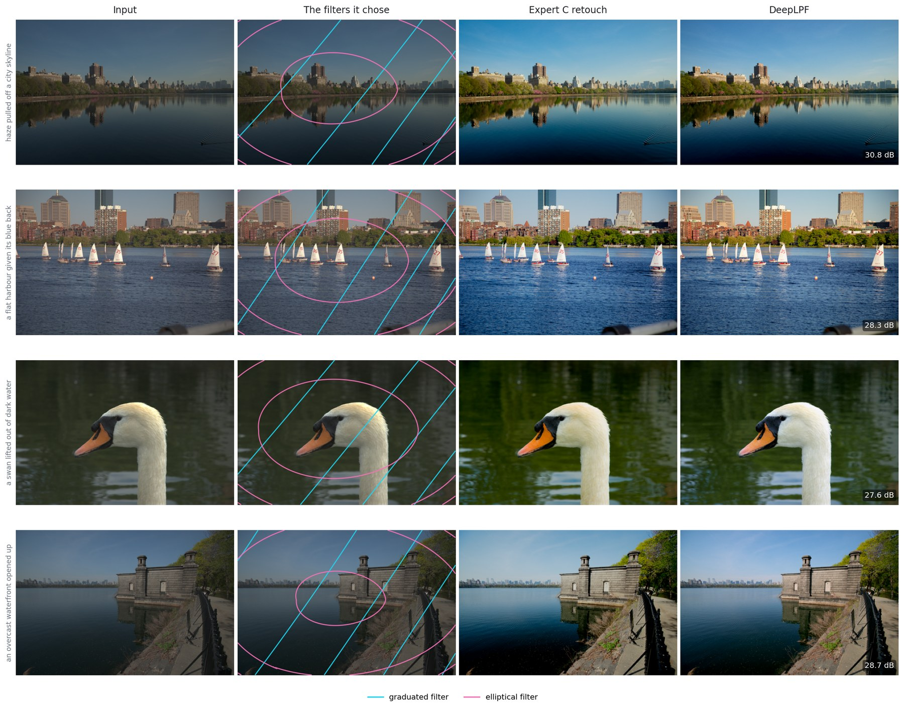
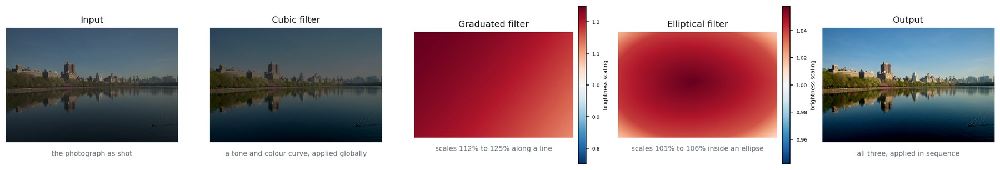

<div align="center">

<h1>DeepLPF</h1>

<p><b>Deep Local Parametric Filters for Image Enhancement</b><br>
<sub>CVPR 2020 · Huawei Noah's Ark Lab</sub></p>

[](https://github.com/sjmoran/deeplpf-image-enhancement/actions/workflows/ci.yml)
[](https://arxiv.org/abs/2003.13985)
[](https://www.python.org/)
[](https://pytorch.org/)
[](#pre-trained-model)
[](./LICENSE)

[Sean Moran](https://sjmoran.github.io/) ·
[Pierre Marza](https://pierremarza.github.io/) ·
[Steven McDonagh](https://smcdonagh.github.io/) ·
[Sarah Parisot](https://parisots.github.io/) ·
Greg Slabaugh

[**Paper**](https://arxiv.org/abs/2003.13985) ·
[**Poster**](https://github.com/sjmoran/sjmoran.github.io/blob/main/pdfs/DeepLPF_CVPR20_poster.pdf) ·
[**Video**](https://www.youtube.com/watch?v=Sxach3FM6FY) ·
[**Supplementary**](https://github.com/sjmoran/sjmoran.github.io/blob/7775d1fc39d14baeb6935f6c750f923e1251f491/pdfs/DeepLPF_supplementary.pdf)

</div>

```bash
pip install -e .
deeplpf enhance photo.jpg
```

Most enhancement networks paint the output pixel by pixel. DeepLPF instead
predicts the settings of a few filters a photographer would recognise - a tone
curve, a graduated filter, an elliptical vignette - and applies them to your
image. The whole model is 1.7M parameters, runs in 46 ms on an Apple GPU, and
tells you what it did.

<p align="center">

</p>

<div align="center"><sub>Four photographs from the FiveK test set, none seen
during training, at 27.6 to 30.8 dB against the Expert C retouch. The second
column draws the filters the model actually predicted over the photograph:
cyan for the graduated filter, pink for the elliptical.</sub></div>

## Contents

[Install](#install) ·
[Enhance your photos](#enhance-your-photos) ·
[How it works](#how-it-works) ·
[Results](#results) ·
[Pre-trained model](#pre-trained-model) ·
[Train it yourself](#train-it-yourself) ·
[Which number, which protocol](#which-number-which-protocol) ·
[Datasets](#datasets) ·
[Citation](#citation)

## Install

```bash
git clone https://github.com/sjmoran/deeplpf-image-enhancement.git
cd deeplpf-image-enhancement
pip install -e .
```

Python 3.11 or newer. Torch comes from your platform's usual wheel; if you
already have a CUDA or ROCm build installed, keep it - the pins in
`requirements.txt` would replace it with the generic one.

## Enhance your photos

```bash
deeplpf enhance photo.jpg               # one file
deeplpf enhance ~/photos --out ~/done   # or a whole directory
```

Results land in `enhanced/` as PNGs. PNG, JPEG, TIFF, BMP and WebP are read,
greyscale and RGBA included. The device is picked for you - CUDA, Apple Silicon
(MPS), or CPU - and `--device` overrides it. A file it cannot use is reported
and skipped rather than taking the rest of the batch down with it.

| | |
|---|---|
| Model size | 1.7M parameters, 6.9 MB |
| Speed, 512x341 image | 46 ms on an M-series GPU, 0.21 s on CPU |
| Input | any resolution with both edges >= 32 px |

## How it works

<p align="center">

</p>

A U-Net backbone reads the image and produces per-pixel features. Three heads
turn those features into filter parameters, and the filters are applied in
sequence. The whole enhancement is a few dozen numbers.

### What the filters actually do

<p align="center">

</p>

<div align="center"><sub>The two masks are the ones the trained model predicted
for this photograph, averaged over the colour channels. Each is scaled to its
own range: these adjustments are a few per cent, which is what makes them look
like a retouch rather than a filter preset.</sub></div>

**Cubic** — a tone and colour curve, applied to the whole image. It is a cubic
polynomial in the pixel's intensity and its position, so it can lift shadows,
roll off highlights and warm or cool the picture, the way the basic panel of a
raw converter does. This is where most of the enhancement happens.

**Graduated** — the graduated neutral-density filter a landscape photographer
slides over the lens: brighter on one side of a line, darker on the other, with
a smooth transition between. The network predicts where the line falls and how
strong the effect is. In the example above it runs diagonally, brightening the
skyline by about 26% at one edge and 10% at the other.

**Elliptical** — a radial filter, the soft oval used to lift a face out of its
background or to add a vignette. The network predicts the ellipse's centre, its
two axes and its rotation. Above, it lifts the middle of the frame by up to 8%
and leaves the corners alone.

Each filter predicts three instances per image, and their effects multiply, so
the model can place three gradients and three ellipses at once. Because these
are the adjustments a photographer already knows, an enhancement can be read
and argued with rather than only looked at. The
[paper](https://arxiv.org/abs/2003.13985) gives the full formulation.

## Results

| Model | Split | PSNR | SSIM |
|---|---|---|---|
| this repository, 1000 epochs | reconstructed | 24.18 dB | 0.917 |
| DeepLPF as published (NamedCurves Tab. 1) | DPE | 23.93 dB | 0.903 |

The weights shipped in this repo score higher than the paper. FiveK has at
least five incompatible protocols; see [Which number, which
protocol](#which-number-which-protocol) before comparing anything to
anything.

## Pre-trained model

`pretrained_models/adobe_dpe/` holds the model trained by this code for 1000
epochs, and it is what `deeplpf enhance` loads by default.

Two capabilities are off by default. Both change the architecture, so a
checkpoint trained with either needs the same flag to load it:

```bash
--learn_filter_count   # learn how many filter instances each image needs
--colour_head          # add a global colour mixer and per-channel tone curve
```

The first predicts a gate per filter instance and penalises the mean gate, so
the network can switch instances off. The second supplies the cross-channel
operation the filter bank otherwise lacks: every head is diagonal, so without it
no filter can express white balance, saturation or a hue shift.

## Train it yourself

Prepare the dataset (see [Datasets](#datasets)) into a directory with `input/`
and `output/` sub-folders, then:

```bash
python3 main.py \
  --training_img_dirpath=./adobe5k_dpe_data/ \
  --train_img_list_path=./adobe5k_dpe/images_train.txt \
  --valid_img_list_path=./adobe5k_dpe/images_valid.txt \
  --test_img_list_path=./adobe5k_dpe/images_test.txt \
  --batch_size=1
```

`--batch_size=1` is the paper's setup; larger batches need `--crop_size`,
because FiveK images vary in size. Evaluation always runs at batch size 1 so
per-image PSNR and SSIM are reported and saved. On an Ampere-or-later GPU,
`--cuda_graphs` cuts the step time by about 4.7x and `--compile` a little more.
Checkpoints are written whenever validation PSNR improves, into a timestamped
`log_*` directory with the metrics in the filename.

A 1000-epoch run takes roughly 19 hours on an A10G. This is the run that
produced the shipped checkpoint:

<p align="center">

</p>

<details>
<summary><b>Reproducing the dataset from the FiveK raws</b> - Lightroom export, organise, verify</summary>

**1. Environment.** Python 3.11 or newer.

```bash
pip install -r requirements.txt
```

**2. Get the raw data.** Download the MIT-Adobe FiveK archive (about 47 GB of
DNGs plus the Lightroom catalogue) from
[the dataset page](https://data.csail.mit.edu/graphics/fivek/).

**3. Render the pairs in Lightroom.** This step needs Lightroom Classic and
cannot be scripted from outside it; the DNGs have to be developed through
Adobe's renderer to match the published data. Open
`fivek_dataset/raw_photos/fivek.lrcat` and export two collections, both as
**PNG / sRGB / 8-bit / long edge 512 px / don't enlarge / original filenames**:

| Collection | Destination | Role |
|---|---|---|
| `InputAsShotZeroed` | `~/fivek/input` | network input |
| `Experts / C` | `~/fivek/output` | target |

The input collection matters. `InputAsShotZeroed` is the one that reproduces
this repo's bundled reference inputs exactly; the `... minus 1.5` renderings
apply a −1.5 EV exposure cut and give inputs roughly 1.6× too dark. Full
walkthrough, including a Lightroom plug-in that does both exports:
[docs/ADOBE_DPE_DATASET.md](./docs/ADOBE_DPE_DATASET.md).

**4. Organise and verify.**

```bash
python3 data_prep/organise_fivek.py ~/fivek/input ~/fivek/output \
    ./adobe5k_dpe_data --long-edge 512 --no-resize
python3 data_prep/verify_dataset.py ./adobe5k_dpe_data
```

First check the export itself against the reference manifest:

```bash
python3 data_prep/verify_export.py ./adobe5k_dpe_data adobe5k_dpe/MANIFEST.json.gz
```

The FiveK photographs are their photographers' copyright and cannot be
redistributed, so this repository ships checksums and per-image statistics
instead — enough to tell you whether your own export matches ours, and what is
wrong when it does not. A correct export reports every image byte-identical. A
wrong one is diagnosed rather than merely rejected, for example:

```
40 differ in pixel values:
  a0001-jmac_DSC1459.png     mean delta R -37.01 G -36.97 B -35.32
-> your images are 32.3 levels darker than the reference: this is the
   signature of a `... minus 1.5` Inputs rendering, which applies a -1.5 EV
   exposure cut. Re-export from `InputAsShotZeroed`.
```

`verify_dataset.py` is then the checkpoint for the whole stage. Expect 5000 pairs
split 2250 train / 2250 valid / 498 test, fully paired, and `mean|Δ|` under 15
against the bundled reference inputs. A large `mean|Δ|` means the wrong `Inputs`
rendering was exported — re-export the inputs and run it again.

**5. Train.**

```bash
python3 main.py \
  --training_img_dirpath=./adobe5k_dpe_data/ \
  --train_img_list_path=./adobe5k_dpe/images_train.txt \
  --valid_img_list_path=./adobe5k_dpe/images_valid.txt \
  --test_img_list_path=./adobe5k_dpe/images_test.txt \
  --batch_size=1
```

Checkpoints are written whenever validation PSNR improves, into a timestamped
`log_*` directory, with the metrics in the filename.

**What to expect.** A 1000-epoch run reaches the low 24s in test PSNR on the
reconstructed split. Numbers from the DPE lists belong to a different test set
and are not comparable with that; see
[docs/BENCHMARK_TABLE.md](./docs/BENCHMARK_TABLE.md).
The fastest way to confirm your pipeline before committing to a full training
run is the [enhance](#enhance-your-photos) command, which runs the
released checkpoint over the bundled examples and prints per-image PSNR/SSIM.

</details>

## Which number, which protocol

DeepLPF appears in the literature as **23.63**, **23.90**, **23.93**, **24.48**
and **24.73** dB. All five are correct, and none is comparable with another:
they are five different protocols, differing in the test set, the input
rendering and the resolution. Every method on FiveK has this problem, and it is
the most common way comparisons go wrong.

**[docs/BENCHMARK_TABLE.md](./docs/BENCHMARK_TABLE.md)** says which number
belongs to which protocol, what each protocol is, and which split files
reproduce it.

## Datasets

DeepLPF is trained on the [MIT-Adobe FiveK](https://data.csail.mit.edu/graphics/fivek/) photographs, processed through Lightroom with Expert C retouching as the target. For a step-by-step walkthrough (Lightroom export settings, the expected folder layout, and helper/verification scripts), see **[docs/ADOBE_DPE_DATASET.md](./docs/ADOBE_DPE_DATASET.md)**.

- **Adobe-DPE** (5000 RGB→RGB pairs): download [here](https://data.csail.mit.edu/graphics/fivek/), then pre-process per the DeepPhotoEnhancer (DPE) [paper](https://github.com/nothinglo/Deep-Photo-Enhancer), using the `InputAsShotZeroed` Lightroom rendering as input and Expert C as target, both exported in sRGB. See the [DPE instructions](https://github.com/nothinglo/Deep-Photo-Enhancer/issues/38#issuecomment-449786636) and [Train it yourself](#train-it-yourself).

  The train/valid/test splits in [`adobe5k_dpe/`](./adobe5k_dpe/) are the **original DPE splits** (2250 / 2250 / **498**), recovered in September 2026 from a third-party mirror of the DPE release after every official link went dead. Provenance in [`adobe5k_dpe/SPLIT_PROVENANCE.md`](./adobe5k_dpe/SPLIT_PROVENANCE.md).
- **Adobe-UPE** (5000 RGB→RGB pairs): download [here](https://data.csail.mit.edu/graphics/fivek/), then pre-process per the DeepUPE [paper](https://github.com/wangruixing/DeepUPE).

## Citation

If you use DeepLPF, its pre-trained models, or this code in your research, please cite:

```
@InProceedings{Moran_2020_CVPR,
author = {Moran, Sean and Marza, Pierre and McDonagh, Steven and Parisot, Sarah and Slabaugh, Gregory},
title = {DeepLPF: Deep Local Parametric Filters for Image Enhancement},
booktitle = {Proceedings of the IEEE/CVF Conference on Computer Vision and Pattern Recognition (CVPR)},
month = {June},
year = {2020}
}
```

## License

Released under the MIT License, the licence the original release shipped
under. See [LICENSE](./LICENSE).

## Contributing

Bug fixes are welcome as pull requests. For new features or extensions, open an
issue first so we can agree the shape before you write it. If you are training
DeepLPF and run into trouble, open an issue - we are happy to help.
